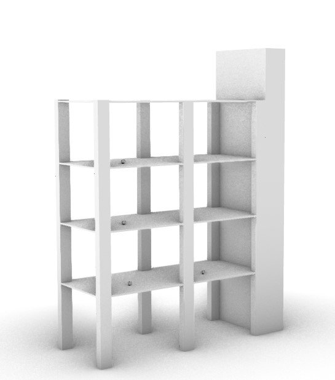

# robotic-navigation
Use of rover for robotic assistance in construction sites. Different demos about robotic navigation 

52% of the time is wasted in material 
handling on construction site

Main goal of this project is propose automated assistance in construction sites with rovers.
Rovers generate horizontal connections in construction sites combining with vertical transportation (cranes and lifts) creating a tridimensional grid to provide materials and tools just in time. 

 
 
# Process

 
  
# Gmapping test # 1
Robot: Kobuki Turtlebot 2 
Location: IAAC Ground Floor
Controller: Keyboard
Scanner: Orbbec Astra
Platform: ROS Kinetic
Connection: Laptop - Kobuki

# Gmapping test # 2
Robot: Kobuki Turtlebot 2 
Location: IAAC Ground Floor
Controller: Joystick (Bluetooth)
Scanner: Orbbec Astra RTAB-Map (Real-Time Appearance-Based Mapping)
Platform: ROS Kinetic
Connection: Laptop - Kobuki

# Gmapping final # 2
Robot: Kobuki Turtlebot 2 
Location: IAAC 1st Floor
Controller: Joystick (Bluetooth)
Scanner: Orbbec Astra

# Gmapping # ros nodes and topics

# Navigation # Autonomous without Obstacle Avoidance (Test Space)

# Navigation # Autonomous without Obstacle Avoidance
Robot: Kobuki Turtlebot 2 
Location: IAAC First Floor
Controller: Auto
Camera: Orbbec Astra
Platform: ROS Kinetic
Connection: Laptop - Kobuki

# Navigation # Autonomous with Obstacle Avoidance (Test Space)

# Navigation # Autonomous with Obstacle Avoidance

# Navigation # ros nodes and topics

# Navigation # with Detection
Robot: Kobuki Turtlebot 2 
Location: IAAC First Floor
Controller: Human
Camera: Orbbec Astra
Platform: ROS Kinetic
Connection: Laptop - Kobuki
Obstacle: Human
# Navigation # Autonomous with Obstacle Avoidance

# Future explorations 

